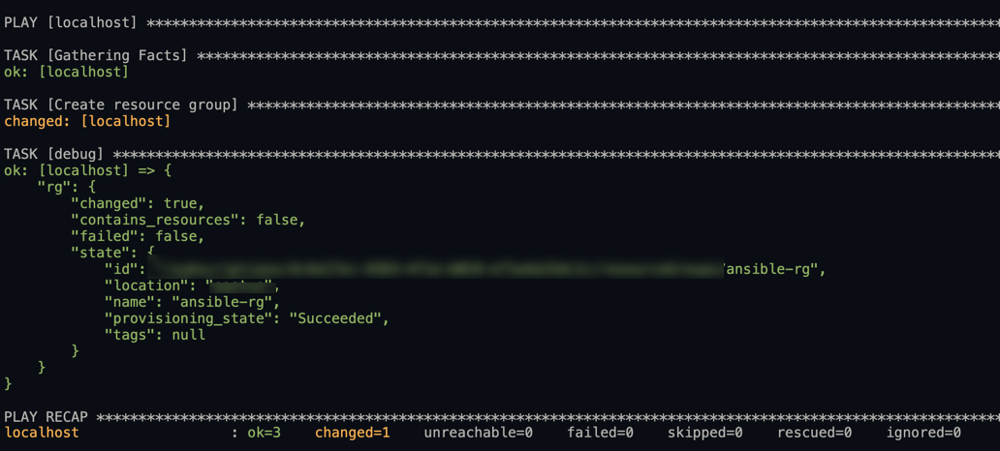

# Connect to Azure with Ansible

## Introduction

Ansible is an open-source software provisioning, configuration management, and application deployment tool that includes a declarative language to describe system configurations. Ansible can configure both Linux and Windows operating systems. It can also deploy, provision, and configure Cloud resources, such as Azure resources. In order to use Ansible with Azure, you must first define the connection settings between the Ansible server and Azure as an infrastructure platform. In this article you'll learn how to connect an Ansible server to Azure using an Azure Service Principal account.

## Prerequisites

* [Azure subscription](https://azure.microsoft.com/free/?ref=microsoft.com&utm_source=microsoft.com&utm_medium=docs&utm_campaign=visualstudio)
* [Ansible installed for Azure](https://docs.microsoft.com/en-us/azure/virtual-machines/linux/ansible-install-configure?toc=%2Fazure%2Fansible%2Ftoc.json&bc=%2Fazure%2Fbread%2Ftoc.json#install-ansible-on-an-azure-linux-virtual-machine)
* [Azure PowerShell module](https://docs.microsoft.com/en-us/powershell/azure/install-az-ps?view=azps-3.1.0)

## Step 1 - Create an Azure Service Principal

The first step is to create an Azure Service Principal account. You will use this to authenticate to your Azure subscription. After the Service Principal is created you will need to grant it permissions to your subscription. In this tutorial you'll be assigning contributor permissions to the entire subscription. In order to create the service principal with Azure PowerShell you'll need to first create a credentials object which contains the password of the new service principal. Using a technique in PowerShell called splatting you'll pass the user name and password it contains to the cmdlet `New-AzAdServicePrincipal`. This cmdlet will create a new service principal in Azure.

[Providing Credentials to Azure Modules](https://docs.ansible.com/ansible/latest/scenario_guides/guide_azure.html#providing-credentials-to-azure-modules)

```powershell
$credentials = New-Object Microsoft.Azure.Commands.ActiveDirectory.PSADPasswordCredential `
-Property @{ StartDate=Get-Date; EndDate=Get-Date -Year 2024; Password='<PASSWORD>'};

$spSplat = @{
    DisplayName = 'sp-cs-ansible'
    PasswordCredential = $credentials
}

$sp = New-AzAdServicePrincipal @spSplat
```

## Step 2 - Assign a Role to the Service Principal

Once the service principal is created next you'll assign permissions to that service principal in Azure. In this tutorial you'll be assigning the Contributor role to the service principal for the entire subscription. The cmdlet for assigning role permissions is `New-AzRoleAssignment`. You need to specify three parameters in order to assign the role to the service principal. The ObjectID, which is the Id property of the service principal you just created. When the service principal was created in Step 1 the output was stored in a variable called `$sp` and the Id property can be accessed by specifying that property on the $sp variable. RoleDefinitionName is set to Contributor and Scope value is set to `/subscription/$subId`. `$subId` is a variable containing the subscription id for the Azure subscription you are targeting. That variable is populated by the `Get-AzSubscription` cmdlet. Update `NameofSubscriptionHere` with the name of your Azure subscription.

```powershell
$subId = (Get-AzSubscription -SubscriptionName 'NameOfSubscriptionHere').id

$roleAssignmentSplat = @{
    ObjectId = $sp.id
    RoleDefinitionName = 'Contributor'
    Scope = "/subscriptions/$subId"
}

New-AzRoleAssignment @roleAssignmentSplat
```

## Step 3 - Create Azure credentials

### Gather Required Information

For this tutorial you'll need the subscription Id, service principal appId, service principal name, and the tenant Id of the service principal to connect Ansible to Azure. All of the required information can be gather with Azure PowerShell cmdlets. After you have the required information you can connect Ansible to Azure in two different ways. You can either use a credentials file or environment variables.

* Subscription Id
* Service Principal AppId
* Service Principal Password
* Tenant Id for the Service Principal

```powershell
$subscriptionId = (Get-AzSubscription -SubscriptionName 'NameOfSubscriptionHere').id

$servicePrincipalAppId = (Get-AzADServicePrincipal -DisplayName 'sp-cs-ansible').ApplicationId

$servicePrincipalPassword = 'Value Specified Previously'

$tenantId = (Get-AzSubscription -SubscriptionName 'NameOfSubscriptionHere').TenantId
```

### Option 1: Use Ansible Credentials File

Ansible looks in specific locations to auto load credentials if certain files exists. The Azure Ansible module uses the path `~/.azure/credentials`. Placing a file in this location with the proper values will result in Ansible being able to connect to Azure. Keep in mind that credential files in Ansible are used for development environments. To use this method create a file at `~/.azure/credentials` and populated the variables subscription_id, client_id, secret, and tenant.

`1.` Create a credentials file

```bash
mkdir ~/.azure
vi ~/.azure/credentials
```

`2.` Populate the required Ansible variables. Replace `<Text>` with actual values.

```bash
[default]
subscription_id=<subscription_id>
client_id=<security-principal-appid>
secret=<security-principal-password>
tenant=<security-principal-tenant>
```

### Option 2: Use Ansible Environment Variables

Instead of using a credentials file you can also populate specific environment variables that Ansible Azure module will use to connect to Azure. Using the bash command `export` you can define these values. Replace `<Text>` with actual values.

```bash
export AZURE_SUBSCRIPTION_ID=<subscription_id>
export AZURE_CLIENT_ID=<security-principal-appid>
export AZURE_SECRET=<security-principal-password>
export AZURE_TENANT=<security-principal-tenant>
```

_Read more about [Providing Credentials to Azure Modules](https://docs.ansible.com/ansible/latest/scenario_guides/guide_azure.html#providing-credentials-to-azure-modules)._

## Step 4 - Run an Ansible Playbook

After you provided the necessary values for Ansible to connect to Azure through either a credentials file or environment variables you can test the connection by running an Ansible playbook.

### Create a playbook file

Ansible playbooks are written in YAML. Create a playbook by creating a new file named playbook.yaml and opening it in vi.

```bash
  vi playbook.yaml
```

### Paste playbook contents in

Below is an Ansible playbook that creates an Azure resource group named `rg-cs-ansible` in the `eastus` region. It also registers the output to an Ansible variable and outputs it with the debug module. Copy and paste in the contents below to populate the playbook.

```yaml
---
- hosts: localhost
  connection: local
  tasks:
    - name: Create resource group
      azure_rm_resourcegroup:
        name: rg-cs-ansible
        location: eastus
      register: rg
    - debug:
        var: rg
```

### Run the playbook using ansible-playbook

To execute the playbook use the ansible command `ansible-playbook` followed by the name of the playbook which is `playbook.yaml`. Once the playbook finishes running you will have a newly created resource group called rg-cs-ansible in Azure!

```bash
ansible-playbook playbook.yaml
```



### Sources

[Using Ansible with Azure](https://docs.microsoft.com/en-us/azure/ansible/ansible-overview)

[Quickstart: Install Ansible on Linux virtual machines in Azure](https://docs.microsoft.com/en-us/azure/virtual-machines/linux/ansible-install-configure?toc=%2Fazure%2Fansible%2Ftoc.json&bc=%2Fazure%2Fbread%2Ftoc.json#install-ansible-on-an-azure-linux-virtual-machine)

[Create an Azure service principal with Azure PowerShell](https://docs.microsoft.com/en-us/powershell/azure/create-azure-service-principal-azureps?view=azps-3.1.0)

[New-AzRoleAssignment](https://docs.microsoft.com/en-us/powershell/module/az.resources/new-azroleassignment?view=azps-3.1.0)
