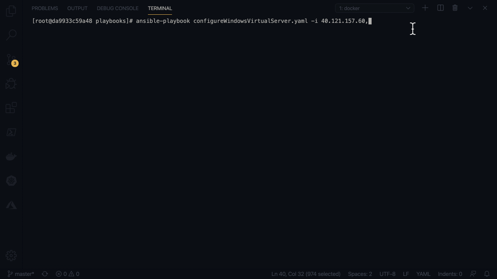
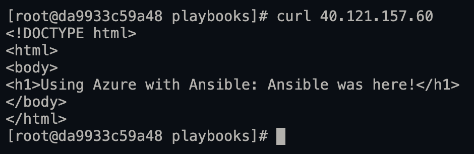

# Configure a Windows Web Server with Ansible in Azure

## Introduction

The goal of this tutorial is to configure an Azure virtual machine as an IIS Web Server. You can think of configuration as any change you need to make inside the virtual machine. These are the types of changes Ansible is typically used for. Ansible uses a concept of tasks that execute sequentially. These tasks are created by using Ansible modules. Ansible modules, also called module libraries contain idempotent functionally that allow you to make changes to or gather information from different systems.

## Prerequisites

In order for you to follow along with this tutorial you'll need the Ansible server connected to Azure. You'll also need several resources deployed to Azure to support a Windows virtual machine hosted in Azure. And before you can connect to the Windows virtual it also needs to be provisioned and WinRM setup. All the steps to accomplish these tasks are laid out in the previous parts of the series.

[Connect to Azure with Ansible]()

[Deploy a Windows Virtual Machine to Azure with Ansible]()

[Connect to an Azure Windows Host with Ansible]()

Ansible's documentation has an index dedicated to Windows modules. Which are prefixed with `win_` at the beginning of the module name. In this tutorial you'll be using several Ansible modules to install and configure an IIS web server. In order to configure the IIS web server you'll use the following Ansible modules. You do not have to install them individually, they come installed with Ansible.

* [win_feature](https://docs.ansible.com/ansible/latest/modules/win_feature_module.html)
* [win_copy](https://docs.ansible.com/ansible/latest/modules/win_copy_module.html)
* [win_chocolatey](https://docs.ansible.com/ansible/latest/modules/win_chocolatey_module.html)
* [win_file](https://docs.ansible.com/ansible/latest/modules/win_file_module.html)

_See the full list of [Ansible Windows Modules](https://docs.ansible.com/ansible/latest/modules/list_of_windows_modules.html)._

## Step 1 - Connect to a Windows Host

Ansible uses variables to determine it's configuration. That configuration also determines how Ansible will attempt to connect and authenticate to a remote target. As expected, there is a difference between the connection configuration for a Linux target and a Windows target. Ansible was also designed for Linux configuration management long before Windows and for that reason much of the default configuration favors Linux. There is no cause for alarm as it is easy to change the connection configuration by defining several variables.

The variables you need to define depends on your WinRM connection type and the authentication option you've chosen. In this tutorial you'll be using WinRM over HTTPS with self-signed certificates and using NTLM for the authentication. The variables that are described here are required for that configuration. If you've chosen a different configuration the variables you need to define will be different.

_Read more about [Connecting to a Windows Host](https://www.ansible.com/blog/connecting-to-a-windows-host) and [Windows Authentication Options](https://docs.ansible.com/ansible/latest/user_guide/windows_winrm.html#authentication-options)._

### Set Ansible Connection Variables

It is worth mentioning that Ansible has several places you can define variables. Where you place the variables matters a great deal because Ansible has a strict variable precedence order. Within this tutorial you'll be defining the variables within a playbook. To define variables scoped to an Ansible playbook you'll first define a `vars` section. Inside that vars section is where you can place the variables. You define variables by defining the name of the variable followed by a colon and then the value of the variable `varName:varValue`. For the WinRM connection to work you're required to specify the following variables:

* ansible_user
* ansible_password
* ansible_connection
* ansible_winrm_transport
* ansible_winrm_server_cert_validation

Several of these variables are self explanatory. `ansible_user` and `ansible_password` are the user name and password of a local administrator account on the Windows virtual machine. `ansible_connection` is set to ssh by default, however since you are targeting a Windows virtual machine this must be set to WinRM. `ansible_winrm_server_cert_validation` is set to ignore because the certificates were generated locally to the virtual machine and are self-signed.  

```yaml
vars:
  ansible_user: azureuser
  ansible_password: '<PASSWORD>'
  ansible_connection: winrm
  ansible_winrm_transport: ntlm
  ansible_winrm_server_cert_validation: ignore
```

_Read more about [Ansible's variable precedence](https://docs.ansible.com/ansible/latest/user_guide/playbooks_variables.html#variable-precedence-where-should-i-put-a-variable)._

## Step 2 - Installing IIS with win_feature

In order to enable functionality for an IIS web server, you have to install the Windows feature `web-server`. Installing this feature installs IIS for hosting web applications. Ansible allows you to do this by using the `win_feature` module. win_feature has a single required parameter, the name. The `name` parameter is used to specify the name of the Windows feature you want to install. By default the `state` parameter is set to present. Which means to install the feature, opposed to absent which would uninstall it. However, explicit defining the parameter makes the task's intent clear. A few optional parameters are used; `include_management_tools` and `include_sub_features`. include_management_tools installs the web-server management tools along with the web-server feature and include_sub_features will install any sub features of web-server.

```yaml
  - name: Install IIS
    win_feature:
        name: web-server
        include_management_tools: yes
        include_sub_features: yes
        state: present
```

## Step 3 - Set the Index Page with win_copy

Next in the playbook you will update the index.html within the `inetpub\wwwroot` directory. Which will result in a new landing page for the web server. To do this you'll crate the index.html on the Ansible server and copy the file to the Windows virtual machine.

```bash
vi index.html
```

```html
<!DOCTYPE html>
<html>
<body>
<h1>Using Azure with Ansible: Ansible was here!</h1>
</body>
</html>
```

_index.html contents._

The `win_copy` Ansible module is used for copying files to remote hosts on Windows. The src parameter is the path of the file on the local Ansible server. The dest parameter is the remote absolute path to where the file is copied to. force is an optional parameter, but allows you to overwrite existing files, if the content is different.

```yaml
  - name: Copy index.html to wwwroot
    win_copy:
      src: index.html
      dest: C:\inetpub\wwwroot\index.html
      force: yes
```

## Step 4 - Install DotNet Core Runtime with win_chocolatey

The applications being deployed to this web server will be self contained dotnetCore applications which require the dotnet core runtime be installed prior to deployment. You can automate the installation of the install by using the win_chocolatey module. The win_chocolatey module requires a `name` parameter which is the name of the chocolatey package being installed. If you are using the public chocolatey feed you can search for packages [here](https://chocolatey.org/packages). However, you can also host them internally as well. The `version` parameter is optional, but allows you to version lock the installation to a version known to work in your environment. `install_args` is used to pass custom arguments to the installer. In this tutorial the install_args are used to exclude framework installs and only install the runtime from the package. `state` can be used to specify if you wish to install or uninstall a particular package. `notify` is part of the hanlders functionality in Ansible. Handlers allow you to run operations on change and skip it if no change is detected. You'll implement a handler later in the playbook.

```yaml
  - name: install net core iis hosting module with no frameworks
    win_chocolatey:
      name: "dotnetcore-windowshosting"
      version: "3.1.0"
      install_args: "OPT_NO_RUNTIME=1 OPT_NO_SHAREDFX=1 OPT_NO_X86=1 OPT_NO_SHARED_CONFIG_CHECK=1"
      state: present
    notify: restart IIS
```

_Learn more about [Simplify Windows Software Packaging and Automation with Chocolatey](https://www.ansible.com/simplify-windows-software) : AnsibleFest Atlanta Session._

## Step 5 - Create a Logs Directory with win_file

To create a log directory you will use the `win_file` Ansible module. It has two parameters path and state. `Path` is the location on the remote target where the directory will be created. `state` is set to directory, which will create a folder on the Windows virtual machine instead of a file.

```yaml
  - name: Create logging directory
    win_file:
        path: c:\logs
        state: directory
```

## Step 6 - Restart IIS with handlers

Handlers in Ansible provide a way for you to run operations only if a change occurs in a task. The win_chocolatey task defined previously requires a restart of IIS, but only if it's the first run of the playbook. All future runs would not require a restart of IIS because the package for dotnetCore would already be installed. Hanlders give you a way to make the restart of IIS only occur when the state of the dotnetCore task changes. 

Handlers are defined under a `handlers` section in the Ansible playbook separate from the tasks. Each handler requires a name. This name is created by the notify name given inside a task. In this tutorial the notify name was set to `restart IIS` within the task that used win_chocolatey to install the dotnetcore runtime. After the name you must define the actions to take. These actions give you the ability to define a set of tasks to run after a change is detected. In this example when the notify `restart IIS` is set to changed this handler will use the Ansible module `win_shell` to execute the command `& {iisreset}`. Which is a command line utility to restart IIS. Ultimately, hanlders make your playbooks idempotent by only trigger certain actions if needed.

```yaml
  handlers:
    - name: restart IIS
      win_shell: '& {iisreset}'
```

_Read more about [Ansible hanlders](https://docs.ansible.com/ansible/latest/user_guide/playbooks_intro.html#handlers-running-operations-on-change)._

## Step 7 - Use Ansible to Configure an Azure Windows IIS Web Server

You now have all the tasks required to configure the Azure Windows IIS Web Server. By putting them all together in a playbook you have an idempotent configuration for the web server. The last thing to add to the playbook are connection variables. These are necessary because Ansible will communicate and authenticate to the remote host using these settings. Replace the connection variable values with ones related to your environment.

```yaml
#configureWindowsVirtualServer.yaml
---
- hosts: all
  
  vars:
    ansible_user: azureuser
    ansible_password: 'P@ssw0rdUseVaultorVarPrompt'
    ansible_connection: winrm
    ansible_winrm_transport: ntlm
    ansible_winrm_server_cert_validation: ignore

  tasks:
  - name: Install IIS
    win_feature:
        name: web-server
        include_management_tools: yes
        include_sub_features: yes
        state: present

  - name: Copy index.html to wwwroot
    win_copy:
      src: index.html
      dest: C:\inetpub\wwwroot\index.html
      force: yes

  - name: install net core iis hosting module with no frameworks
    win_chocolatey:
      name: "dotnetcore-windowshosting"
      version: "3.1.0"
      install_args: "OPT_NO_RUNTIME=1 OPT_NO_SHAREDFX=1 OPT_NO_X86=1 OPT_NO_SHARED_CONFIG_CHECK=1"
      state: present
    notify: restart IIS

  - name: Create logging directory
    win_file:
        path: c:\logs
        state: directory

  handlers:
    - name: restart IIS
      win_shell: '& {iisreset}'
```

Before you can execute the playbook against the remote host you will need the Ip address or DNS name. Using the `,` with the `i` parameter allows you to use a host list for the Ansible inventory.

```bash
ansible-playbook configureWindowsVirtualServer.yaml -i 40.121.157.60,
```



Confirm the Azure Windows virtual machine was configured properly by using curl against the public Ip address. You should see the index.html contents return.

```bash
curl 40.121.157.60
```



## Conclusion

Whether you manage mutable or immutable infrastructure, defining your Infrastructure as Code is a critical step in that process. Infrastructure as Code has several components to it, but step one is documenting the state of your infrastructure. Ansible gives you the ability to capture your infrastructure's state in YAML files and apply that state with idempotent tasks that you can run over and over again without fear of breaking something.

Once you start to define your infrastructure stack as code, you'll being to realize the effort involved in the task. Get comfortable using other people's code. Leverage the modules Ansible provides. As well as the modules the Ansible community has built. This will save you time, time you can spend adding true value.

Ansible isn't the only player in the game. Depending on your platform and technology stack there are many tools and technologies that can do what Ansible does. Take the time to understand why Ansible is or isn't the best fit for you and your team. The dichotomy is to not let this question stop you from experimenting with Ansible. You'll have to use it and gain some fundamental knowledge in order to answer the question of "Is this the right tool?".

Be prepare to defend your choice. Everyone has their favorite vendor, favorite tooling, and favorite languages. Chances are you will run into some resistance when introducing the tooling. Seek to understand their concerns and address them with educated answers, useful training, and documentation.
